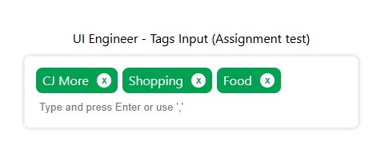

## Installation

1. install dependencies:
   ```sh
   npm install
   ```
2. Start the development server:
   ```sh
   npm run dev
   ```

## Features



- Add multiple tags separated by a comma (or a custom separator)
- Prevent duplicate tags
- Remove tags by clicking the "X" button
- Auto-add tags when input loses focus

## Usage

```tsx
import React from "react";
import TagInputComponent from './components/tags-input'

const App: React.FC = () => {
  return (
    <div>
      <h2>Tag Input Example</h2>
      <TagInput separator="," />
    </div>
  );
};

export default App;
```

## Props

| Prop        | Type     | Default | Description                             |
| ----------- | -------- | ------- | --------------------------------------- |
| `separator` | `string` | `","`   | Defines the separator for multiple tags |

## Styling

The component uses `style.css` for styling in folder styles. You can modify it to fit your design.

```css
.tag-input-container {
  width: 100%;
  max-width: 400px;
  border: 1px solid #ccc;
  padding: 8px;
  border-radius: 8px;
}

.tag-input-wrapper {
  display: flex;
  flex-wrap: wrap;
  gap: 6px;
  padding: 6px;
  min-height: 40px;
}
```

## License

This component create by Saharat phonpo

---

